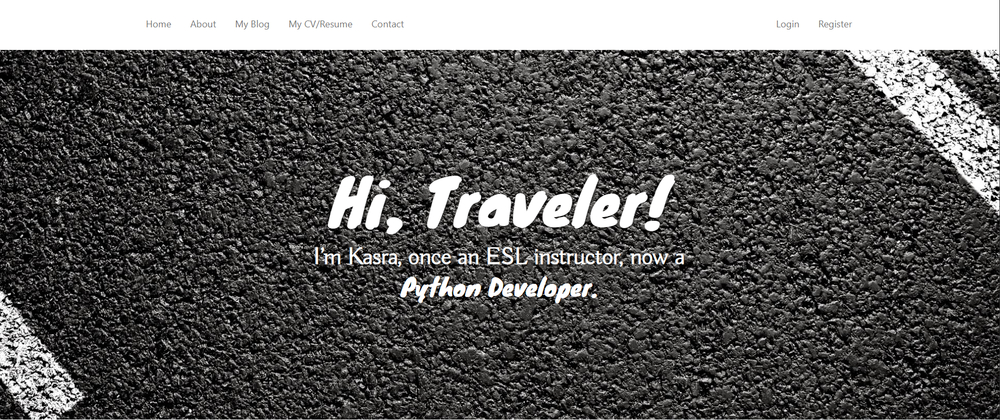

# My Personal Website

A fully custom-built personal website developed with **Flask**, **SQLAlchemy**, **WTForms**, **Jinja**, **HTML**, **CSS**, and **Bootstrap**.  
This project is both a portfolio of my abilities as a developer and a personal hub where visitors can learn more about me.

---

## 🌐 Features

- **Homepage** with a personalized hero section and navigation bar.
- **About page** to share my hobbies, interests, lifestyle, education, and experiences.
- **Blog page** where:
  - Visitors can read my articles.
  - Users can register, log in, and leave comments.
- **Contact page** to connect with me easily.
- **Resume & CV** using Bootstrap for a seamless experience on all devices.

---

## 🛠️ Tech Stack

- **Backend:** Flask (Python)
- **Database:** SQLAlchemy
- **Forms & Validation:** WTForms
- **Templating Engine:** Jinja
- **Frontend:** HTML, CSS, Bootstrap
- **Authentication:** Flask-Login

---

## 📸 Screenshots

### Homepage

